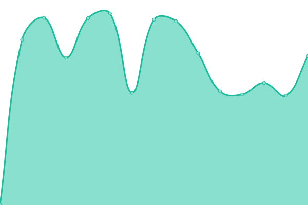
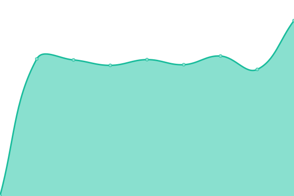
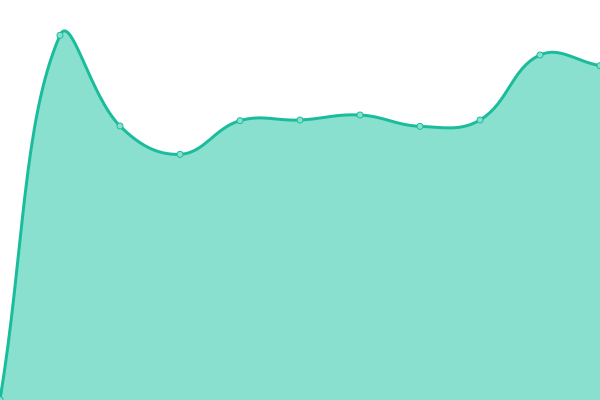
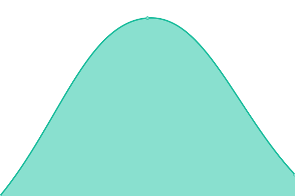
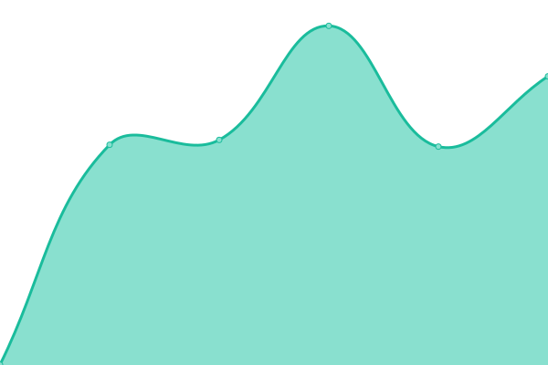

# [📈 Live Status](https://labelvier.github.io/upptime): <!--live status--> **🟧 Partial outage**

This repository contains the open-source uptime monitor and status page for [Label Vier](https://labelvier.nl), powered by [Upptime](https://github.com/upptime/upptime).

With [Upptime](https://upptime.js.org), you can get your own unlimited and free uptime monitor and status page, powered entirely by a GitHub repository. We use [Issues](https://github.com/labelvier/upptime/issues) as incident reports, [Actions](https://github.com/labelvier/upptime/actions) as uptime monitors, and [Pages](https://labelvier.github.io/upptime) for the status page.

<!--start: status pages-->
<!-- This summary is generated by Upptime (https://github.com/upptime/upptime) -->
<!-- Do not edit this manually, your changes will be overwritten -->
<!-- prettier-ignore -->
| URL | Status | History | Response Time | Uptime |
| --- | ------ | ------- | ------------- | ------ |
|  [Labelvier](https://labelvier.nl) | 🟩 Up | [labelvier.yml](https://github.com/labelvier/upptime/commits/HEAD/history/labelvier.yml) | 

 1077ms
     
 | 

<a href="https://labelvier.github.io/upptime/history/labelvier">100.00%</a>
    

|  [Upptime test L4](https://upptime.labelvier.dev) | 🟩 Up | [upptime-test-l4.yml](https://github.com/labelvier/upptime/commits/HEAD/history/upptime-test-l4.yml) | 

 1079ms
     
 | 

<a href="https://labelvier.github.io/upptime/history/upptime-test-l4">99.16%</a>
    

|  [Falkena](https://falkena.nl) | 🟩 Up | [falkena.yml](https://github.com/labelvier/upptime/commits/HEAD/history/falkena.yml) | 

 672ms
     
 | 

<a href="https://labelvier.github.io/upptime/history/falkena">100.00%</a>
    

|  [Fiber Unlimited](https://fiberunlimited.com) | 🟩 Up | [fiber-unlimited.yml](https://github.com/labelvier/upptime/commits/HEAD/history/fiber-unlimited.yml) | 

 711ms
     
 | 

<a href="https://labelvier.github.io/upptime/history/fiber-unlimited">100.00%</a>
    

|  [Fundatis](https://fundatis.nl) | 🟩 Up | [fundatis.yml](https://github.com/labelvier/upptime/commits/HEAD/history/fundatis.yml) | 

 763ms
     
 | 

<a href="https://labelvier.github.io/upptime/history/fundatis">100.00%</a>
    

|  [Seats2meet](https://gdpr.seats2meet.com) | 🟩 Up | [seats2meet.yml](https://github.com/labelvier/upptime/commits/HEAD/history/seats2meet.yml) | 

 908ms
     
 | 

<a href="https://labelvier.github.io/upptime/history/seats2meet">100.00%</a>
    

|  [Jurriëns](https://jurriens.nl) | 🟩 Up | [jurriens.yml](https://github.com/labelvier/upptime/commits/HEAD/history/jurriens.yml) | 

 774ms
     
 | 

<a href="https://labelvier.github.io/upptime/history/jurriens">100.00%</a>
    

|  [Peek Maps](https://maps.peek.app) | 🟩 Up | [peek-maps.yml](https://github.com/labelvier/upptime/commits/HEAD/history/peek-maps.yml) | 

 622ms
     
 | 

<a href="https://labelvier.github.io/upptime/history/peek-maps">100.00%</a>
    

|  [Bicycling shop](https://next.shop.bicycling.nl) | 🟩 Up | [bicycling-shop.yml](https://github.com/labelvier/upptime/commits/HEAD/history/bicycling-shop.yml) | 

 827ms
     
 | 

<a href="https://labelvier.github.io/upptime/history/bicycling-shop">100.00%</a>
    

|  [Mens health shop](https://next.shop.menshealth.nl) | 🟩 Up | [mens-health-shop.yml](https://github.com/labelvier/upptime/commits/HEAD/history/mens-health-shop.yml) | 

 873ms
     
 | 

<a href="https://labelvier.github.io/upptime/history/mens-health-shop">100.00%</a>
    

|  [Runners shop](https://next.shop.runners.nl) | 🟩 Up | [runners-shop.yml](https://github.com/labelvier/upptime/commits/HEAD/history/runners-shop.yml) | 

 974ms
     
 | 

<a href="https://labelvier.github.io/upptime/history/runners-shop">100.00%</a>
    

|  [Voetbal International shop](https://next.shop.vi.nl) | 🟥 Down | [voetbal-international-shop.yml](https://github.com/labelvier/upptime/commits/HEAD/history/voetbal-international-shop.yml) | 

 1508ms
     
 | 

<a href="https://labelvier.github.io/upptime/history/voetbal-international-shop">31.07%</a>
    

|  [Womens health magazine shop](https://next.shop.womenshealthmag.nl) | 🟩 Up | [womens-health-magazine-shop.yml](https://github.com/labelvier/upptime/commits/HEAD/history/womens-health-magazine-shop.yml) | 

 787ms
     
 | 

<a href="https://labelvier.github.io/upptime/history/womens-health-magazine-shop">100.00%</a>
    

|  [Ondertekenen Labelvier](https://ondertekenen.labelvier.nl) | 🟩 Up | [ondertekenen-labelvier.yml](https://github.com/labelvier/upptime/commits/HEAD/history/ondertekenen-labelvier.yml) | 

 1302ms
     
 | 

<a href="https://labelvier.github.io/upptime/history/ondertekenen-labelvier">100.00%</a>
    

|  [Bicycling shop](https://shop.bicycling.nl) | 🟩 Up | [bicycling-shop.yml](https://github.com/labelvier/upptime/commits/HEAD/history/bicycling-shop.yml) | 

 827ms
     
 | 

<a href="https://labelvier.github.io/upptime/history/bicycling-shop">100.00%</a>
    

|  [Mens health shop](https://shop.menshealth.nl) | 🟩 Up | [mens-health-shop.yml](https://github.com/labelvier/upptime/commits/HEAD/history/mens-health-shop.yml) | 

 873ms
     
 | 

<a href="https://labelvier.github.io/upptime/history/mens-health-shop">100.00%</a>
    

|  [Runners shop](https://shop.runners.nl) | 🟩 Up | [runners-shop.yml](https://github.com/labelvier/upptime/commits/HEAD/history/runners-shop.yml) | 

 974ms
     
 | 

<a href="https://labelvier.github.io/upptime/history/runners-shop">100.00%</a>
    

|  [Voetbal international shop](https://shop.vi.nl) | 🟥 Down | [voetbal-international-shop.yml](https://github.com/labelvier/upptime/commits/HEAD/history/voetbal-international-shop.yml) | 

 1508ms
     
 | 

<a href="https://labelvier.github.io/upptime/history/voetbal-international-shop">31.04%</a>
    

|  [Womens health magazine shop](https://shop.womenshealthmag.nl) | 🟩 Up | [womens-health-magazine-shop.yml](https://github.com/labelvier/upptime/commits/HEAD/history/womens-health-magazine-shop.yml) | 

 787ms
     
 | 

<a href="https://labelvier.github.io/upptime/history/womens-health-magazine-shop">100.00%</a>
    

|  [Stadsjochies](https://stadsjochies.nl) | 🟩 Up | [stadsjochies.yml](https://github.com/labelvier/upptime/commits/HEAD/history/stadsjochies.yml) | 

 766ms
     
 | 

<a href="https://labelvier.github.io/upptime/history/stadsjochies">100.00%</a>
    

|  [Cyberdigma support](https://support.cyberdigma.nl) | 🟥 Down | [cyberdigma-support.yml](https://github.com/labelvier/upptime/commits/HEAD/history/cyberdigma-support.yml) | 

 73ms
     
 | 

<a href="https://labelvier.github.io/upptime/history/cyberdigma-support">0.00%</a>
    

|  [Label Vier Updater](https://updater.labelvier.nl) | 🟩 Up | [label-vier-updater.yml](https://github.com/labelvier/upptime/commits/HEAD/history/label-vier-updater.yml) | 

 732ms
     
 | 

<a href="https://labelvier.github.io/upptime/history/label-vier-updater">100.00%</a>
    

<!--end: status pages-->

[**Visit our status website →**](https://labelvier.github.io/upptime)

## 📄 License

- Powered by: [Upptime](https://github.com/upptime/upptime)
- Code: [MIT](./LICENSE) © [Anand Chowdhary](https://anandchowdhary.com), supported by [Pabio](https://pabio.com)
- Data in the `./history` directory: [Open Database License](https://opendatacommons.org/licenses/odbl/1-0/)
