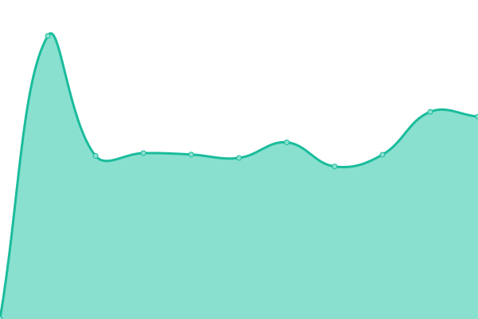
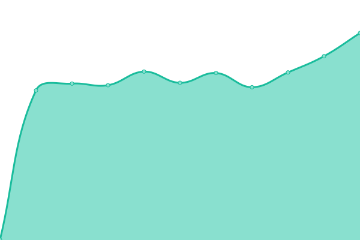

# [📈 Live Status](https://labelvier.github.io/upptime): <!--live status--> **🟧 Partial outage**

This repository contains the open-source uptime monitor and status page for [Label Vier](https://labelvier.nl), powered by [Upptime](https://github.com/upptime/upptime).

With [Upptime](https://upptime.js.org), you can get your own unlimited and free uptime monitor and status page, powered entirely by a GitHub repository. We use [Issues](https://github.com/labelvier/upptime/issues) as incident reports, [Actions](https://github.com/labelvier/upptime/actions) as uptime monitors, and [Pages](https://labelvier.github.io/upptime) for the status page.

<!--start: status pages-->
<!-- This summary is generated by Upptime (https://github.com/upptime/upptime) -->
<!-- Do not edit this manually, your changes will be overwritten -->
<!-- prettier-ignore -->
| URL | Status | History | Response Time | Uptime |
| --- | ------ | ------- | ------------- | ------ |
|  [Labelvier](https://labelvier.nl) | 🟩 Up | [labelvier.yml](https://github.com/labelvier/upptime/commits/HEAD/history/labelvier.yml) | 

 1032ms
     
 | 

<a href="https://labelvier.github.io/upptime/history/labelvier">100.00%</a>
    

|  [Upptime test L4](https://upptime.labelvier.dev) | 🟩 Up | [upptime-test-l4.yml](https://github.com/labelvier/upptime/commits/HEAD/history/upptime-test-l4.yml) | 

 1006ms
     
 | 

<a href="https://labelvier.github.io/upptime/history/upptime-test-l4">99.65%</a>
    

|  [Falkena](https://falkena.nl) | 🟩 Up | [falkena.yml](https://github.com/labelvier/upptime/commits/HEAD/history/falkena.yml) | 

 784ms
     
 | 

<a href="https://labelvier.github.io/upptime/history/falkena">100.00%</a>
    

|  [Fiber Unlimited](https://fiberunlimited.com) | 🟩 Up | [fiber-unlimited.yml](https://github.com/labelvier/upptime/commits/HEAD/history/fiber-unlimited.yml) | 

 754ms
     
 | 

<a href="https://labelvier.github.io/upptime/history/fiber-unlimited">100.00%</a>
    

|  [Fundatis](https://fundatis.nl) | 🟩 Up | [fundatis.yml](https://github.com/labelvier/upptime/commits/HEAD/history/fundatis.yml) | 

 833ms
     
 | 

<a href="https://labelvier.github.io/upptime/history/fundatis">100.00%</a>
    

|  [Seats2meet](https://gdpr.seats2meet.com) | 🟩 Up | [seats2meet.yml](https://github.com/labelvier/upptime/commits/HEAD/history/seats2meet.yml) | 

 745ms
     
 | 

<a href="https://labelvier.github.io/upptime/history/seats2meet">100.00%</a>
    

|  [Jurriëns](https://jurriens.nl) | 🟩 Up | [jurriens.yml](https://github.com/labelvier/upptime/commits/HEAD/history/jurriens.yml) | 

 852ms
     
 | 

<a href="https://labelvier.github.io/upptime/history/jurriens">100.00%</a>
    

|  [Peek Maps](https://maps.peek.app) | 🟩 Up | [peek-maps.yml](https://github.com/labelvier/upptime/commits/HEAD/history/peek-maps.yml) | 

 591ms
     
 | 

<a href="https://labelvier.github.io/upptime/history/peek-maps">100.00%</a>
    

|  [Bicycling shop](https://next.shop.bicycling.nl) | 🟩 Up | [bicycling-shop.yml](https://github.com/labelvier/upptime/commits/HEAD/history/bicycling-shop.yml) | 

 870ms
     
 | 

<a href="https://labelvier.github.io/upptime/history/bicycling-shop">100.00%</a>
    

|  [Mens health shop](https://next.shop.menshealth.nl) | 🟩 Up | [mens-health-shop.yml](https://github.com/labelvier/upptime/commits/HEAD/history/mens-health-shop.yml) | 

 889ms
     
 | 

<a href="https://labelvier.github.io/upptime/history/mens-health-shop">100.00%</a>
    

|  [Runners shop](https://next.shop.runners.nl) | 🟩 Up | [runners-shop.yml](https://github.com/labelvier/upptime/commits/HEAD/history/runners-shop.yml) | 

 923ms
     
 | 

<a href="https://labelvier.github.io/upptime/history/runners-shop">100.00%</a>
    

|  [Voetbal International shop](https://next.shop.vi.nl) | 🟩 Up | [voetbal-international-shop.yml](https://github.com/labelvier/upptime/commits/HEAD/history/voetbal-international-shop.yml) | 

 1289ms
     
 | 

<a href="https://labelvier.github.io/upptime/history/voetbal-international-shop">98.72%</a>
    

|  [Womens health magazine shop](https://next.shop.womenshealthmag.nl) | 🟩 Up | [womens-health-magazine-shop.yml](https://github.com/labelvier/upptime/commits/HEAD/history/womens-health-magazine-shop.yml) | 

 832ms
     
 | 

<a href="https://labelvier.github.io/upptime/history/womens-health-magazine-shop">100.00%</a>
    

|  [Ondertekenen Labelvier](https://ondertekenen.labelvier.nl) | 🟩 Up | [ondertekenen-labelvier.yml](https://github.com/labelvier/upptime/commits/HEAD/history/ondertekenen-labelvier.yml) | 

 1016ms
     
 | 

<a href="https://labelvier.github.io/upptime/history/ondertekenen-labelvier">100.00%</a>
    

|  [Bicycling shop](https://shop.bicycling.nl) | 🟩 Up | [bicycling-shop.yml](https://github.com/labelvier/upptime/commits/HEAD/history/bicycling-shop.yml) | 

 870ms
     
 | 

<a href="https://labelvier.github.io/upptime/history/bicycling-shop">100.00%</a>
    

|  [Mens health shop](https://shop.menshealth.nl) | 🟩 Up | [mens-health-shop.yml](https://github.com/labelvier/upptime/commits/HEAD/history/mens-health-shop.yml) | 

 889ms
     
 | 

<a href="https://labelvier.github.io/upptime/history/mens-health-shop">100.00%</a>
    

|  [Runners shop](https://shop.runners.nl) | 🟩 Up | [runners-shop.yml](https://github.com/labelvier/upptime/commits/HEAD/history/runners-shop.yml) | 

 923ms
     
 | 

<a href="https://labelvier.github.io/upptime/history/runners-shop">100.00%</a>
    

|  [Voetbal international shop](https://shop.vi.nl) | 🟩 Up | [voetbal-international-shop.yml](https://github.com/labelvier/upptime/commits/HEAD/history/voetbal-international-shop.yml) | 

 1289ms
     
 | 

<a href="https://labelvier.github.io/upptime/history/voetbal-international-shop">98.72%</a>
    

|  [Womens health magazine shop](https://shop.womenshealthmag.nl) | 🟩 Up | [womens-health-magazine-shop.yml](https://github.com/labelvier/upptime/commits/HEAD/history/womens-health-magazine-shop.yml) | 

 832ms
     
 | 

<a href="https://labelvier.github.io/upptime/history/womens-health-magazine-shop">100.00%</a>
    

|  [Stadsjochies](https://stadsjochies.nl) | 🟩 Up | [stadsjochies.yml](https://github.com/labelvier/upptime/commits/HEAD/history/stadsjochies.yml) | 

 912ms
     
 | 

<a href="https://labelvier.github.io/upptime/history/stadsjochies">100.00%</a>
    

|  [Label Vier Updater](https://updater.labelvier.nl) | 🟩 Up | [label-vier-updater.yml](https://github.com/labelvier/upptime/commits/HEAD/history/label-vier-updater.yml) | 

 849ms
     
 | 

<a href="https://labelvier.github.io/upptime/history/label-vier-updater">100.00%</a>
    

|  [4returns.commonland.com](https://4returns.commonland.com) | 🟩 Up | [4returns-commonland-com.yml](https://github.com/labelvier/upptime/commits/HEAD/history/4returns-commonland-com.yml) | 

 1039ms
     
 | 

<a href="https://labelvier.github.io/upptime/history/4returns-commonland-com">100.00%</a>
    

|  [80dayscoffee.com](https://80dayscoffee.com) | 🟩 Up | [80dayscoffee-com.yml](https://github.com/labelvier/upptime/commits/HEAD/history/80dayscoffee-com.yml) | 

 1008ms
     
 | 

<a href="https://labelvier.github.io/upptime/history/80dayscoffee-com">100.00%</a>
    

|  [adwinpeeks.nl](https://adwinpeeks.nl) | 🟩 Up | [adwinpeeks-nl.yml](https://github.com/labelvier/upptime/commits/HEAD/history/adwinpeeks-nl.yml) | 

 1135ms
     
 | 

<a href="https://labelvier.github.io/upptime/history/adwinpeeks-nl">100.00%</a>
    

|  [afrisiantravels.com](https://afrisiantravels.com) | 🟩 Up | [afrisiantravels-com.yml](https://github.com/labelvier/upptime/commits/HEAD/history/afrisiantravels-com.yml) | 

 820ms
     
 | 

<a href="https://labelvier.github.io/upptime/history/afrisiantravels-com">100.00%</a>
    

|  [alfaramen.nl](https://alfaramen.nl) | 🟩 Up | [alfaramen-nl.yml](https://github.com/labelvier/upptime/commits/HEAD/history/alfaramen-nl.yml) | 

 677ms
     
 | 

<a href="https://labelvier.github.io/upptime/history/alfaramen-nl">100.00%</a>
    

|  [allergytherapeutics.nl](https://allergytherapeutics.nl) | 🟩 Up | [allergytherapeutics-nl.yml](https://github.com/labelvier/upptime/commits/HEAD/history/allergytherapeutics-nl.yml) | 

 1349ms
     
 | 

<a href="https://labelvier.github.io/upptime/history/allergytherapeutics-nl">100.00%</a>
    

|  [allesoverhooikoorts.nl](https://allesoverhooikoorts.nl) | 🟩 Up | [allesoverhooikoorts-nl.yml](https://github.com/labelvier/upptime/commits/HEAD/history/allesoverhooikoorts-nl.yml) | 

 892ms
     
 | 

<a href="https://labelvier.github.io/upptime/history/allesoverhooikoorts-nl">100.00%</a>
    

|  [anneliesbraams.nl](https://anneliesbraams.nl) | 🟩 Up | [anneliesbraams-nl.yml](https://github.com/labelvier/upptime/commits/HEAD/history/anneliesbraams-nl.yml) | 

 880ms
     
 | 

<a href="https://labelvier.github.io/upptime/history/anneliesbraams-nl">100.00%</a>
    

|  [app.thuisleefbieb.nl](https://app.thuisleefbieb.nl) | 🟩 Up | [app-thuisleefbieb-nl.yml](https://github.com/labelvier/upptime/commits/HEAD/history/app-thuisleefbieb-nl.yml) | 

 2632ms
     
 | 

<a href="https://labelvier.github.io/upptime/history/app-thuisleefbieb-nl">100.00%</a>
    

|  [avs.nl](https://avs.nl) | 🟩 Up | [avs-nl.yml](https://github.com/labelvier/upptime/commits/HEAD/history/avs-nl.yml) | 

 978ms
     
 | 

<a href="https://labelvier.github.io/upptime/history/avs-nl">100.00%</a>
    

|  [balkonfabriek.nl](https://balkonfabriek.nl) | 🟩 Up | [balkonfabriek-nl.yml](https://github.com/labelvier/upptime/commits/HEAD/history/balkonfabriek-nl.yml) | 

 879ms
     
 | 

<a href="https://labelvier.github.io/upptime/history/balkonfabriek-nl">100.00%</a>
    

|  [bedderx.com](https://bedderx.com) | 🟩 Up | [bedderx-com.yml](https://github.com/labelvier/upptime/commits/HEAD/history/bedderx-com.yml) | 

 2257ms
     
 | 

<a href="https://labelvier.github.io/upptime/history/bedderx-com">100.00%</a>
    

|  [beheer.bouwkeet.app](https://beheer.bouwkeet.app) | 🟩 Up | [beheer-bouwkeet-app.yml](https://github.com/labelvier/upptime/commits/HEAD/history/beheer-bouwkeet-app.yml) | 

 900ms
     
 | 

<a href="https://labelvier.github.io/upptime/history/beheer-bouwkeet-app">100.00%</a>
    

|  [beixo.nl](https://beixo.nl) | 🟩 Up | [beixo-nl.yml](https://github.com/labelvier/upptime/commits/HEAD/history/beixo-nl.yml) | 

 1712ms
     
 | 

<a href="https://labelvier.github.io/upptime/history/beixo-nl">100.00%</a>
    

|  [berseba.nl](https://berseba.nl) | 🟩 Up | [berseba-nl.yml](https://github.com/labelvier/upptime/commits/HEAD/history/berseba-nl.yml) | 

 861ms
     
 | 

<a href="https://labelvier.github.io/upptime/history/berseba-nl">100.00%</a>
    

|  [bestellen.bouwmarkt.nl](https://bestellen.bouwmarkt.nl) | 🟩 Up | [bestellen-bouwmarkt-nl.yml](https://github.com/labelvier/upptime/commits/HEAD/history/bestellen-bouwmarkt-nl.yml) | 

 1727ms
     
 | 

<a href="https://labelvier.github.io/upptime/history/bestellen-bouwmarkt-nl">100.00%</a>
    

|  [betteld.nl](https://betteld.nl) | 🟩 Up | [betteld-nl.yml](https://github.com/labelvier/upptime/commits/HEAD/history/betteld-nl.yml) | 

 900ms
     
 | 

<a href="https://labelvier.github.io/upptime/history/betteld-nl">100.00%</a>
    

|  [betteldagenda.nl](https://betteldagenda.nl) | 🟩 Up | [betteldagenda-nl.yml](https://github.com/labelvier/upptime/commits/HEAD/history/betteldagenda-nl.yml) | 

 1431ms
     
 | 

<a href="https://labelvier.github.io/upptime/history/betteldagenda-nl">100.00%</a>
    

|  [bouflegal.nl](https://bouflegal.nl) | 🟩 Up | [bouflegal-nl.yml](https://github.com/labelvier/upptime/commits/HEAD/history/bouflegal-nl.yml) | 

 860ms
     
 | 

<a href="https://labelvier.github.io/upptime/history/bouflegal-nl">100.00%</a>
    

|  [bouwmarkt.nl](https://bouwmarkt.nl) | 🟩 Up | [bouwmarkt-nl.yml](https://github.com/labelvier/upptime/commits/HEAD/history/bouwmarkt-nl.yml) | 

 969ms
     
 | 

<a href="https://labelvier.github.io/upptime/history/bouwmarkt-nl">100.00%</a>
    

|  [bronscholen.nl](https://bronscholen.nl) | 🟩 Up | [bronscholen-nl.yml](https://github.com/labelvier/upptime/commits/HEAD/history/bronscholen-nl.yml) | 

 1792ms
     
 | 

<a href="https://labelvier.github.io/upptime/history/bronscholen-nl">100.00%</a>
    

|  [buytentuindesign.nl](https://buytentuindesign.nl) | 🟩 Up | [buytentuindesign-nl.yml](https://github.com/labelvier/upptime/commits/HEAD/history/buytentuindesign-nl.yml) | 

 773ms
     
 | 

<a href="https://labelvier.github.io/upptime/history/buytentuindesign-nl">100.00%</a>
    

|  [cgk.nl](https://cgk.nl) | 🟩 Up | [cgk-nl.yml](https://github.com/labelvier/upptime/commits/HEAD/history/cgk-nl.yml) | 

 892ms
     
 | 

<a href="https://labelvier.github.io/upptime/history/cgk-nl">100.00%</a>
    

|  [CHB Develop Endpoint](https://chb.gebruikersportaal.nl/cii/token/chbtest) | 🟩 Up | [chb-develop-endpoint.yml](https://github.com/labelvier/upptime/commits/HEAD/history/chb-develop-endpoint.yml) | 

 683ms
     
 | 

<a href="https://labelvier.github.io/upptime/history/chb-develop-endpoint">100.00%</a>
    

|  [chb.herstelverzoek.nl](https://chb.herstelverzoek.nl) | 🟩 Up | [chb-herstelverzoek-nl.yml](https://github.com/labelvier/upptime/commits/HEAD/history/chb-herstelverzoek-nl.yml) | 

 342ms
     
 | 

<a href="https://labelvier.github.io/upptime/history/chb-herstelverzoek-nl">100.00%</a>
    

|  [christianholidays.guide](https://christianholidays.guide) | 🟩 Up | [christianholidays-guide.yml](https://github.com/labelvier/upptime/commits/HEAD/history/christianholidays-guide.yml) | 

 1121ms
     
 | 

<a href="https://labelvier.github.io/upptime/history/christianholidays-guide">100.00%</a>
    

|  [Coenhagedoorn.nl](https://coenhagedoorn.nl) | 🟩 Up | [coenhagedoorn-nl.yml](https://github.com/labelvier/upptime/commits/HEAD/history/coenhagedoorn-nl.yml) | 

 1067ms
     
 | 

<a href="https://labelvier.github.io/upptime/history/coenhagedoorn-nl">100.00%</a>
    

|  [commonland.com](https://commonland.com) | 🟩 Up | [commonland-com.yml](https://github.com/labelvier/upptime/commits/HEAD/history/commonland-com.yml) | 

 1179ms
     
 | 

<a href="https://labelvier.github.io/upptime/history/commonland-com">100.00%</a>
    

|  [dealerportaal.winwheelz.nl](https://dealerportaal.winwheelz.nl) | 🟩 Up | [dealerportaal-winwheelz-nl.yml](https://github.com/labelvier/upptime/commits/HEAD/history/dealerportaal-winwheelz-nl.yml) | 

 1381ms
     
 | 

<a href="https://labelvier.github.io/upptime/history/dealerportaal-winwheelz-nl">100.00%</a>
    

|  [debronscholen.nl](https://debronscholen.nl) | 🟩 Up | [debronscholen-nl.yml](https://github.com/labelvier/upptime/commits/HEAD/history/debronscholen-nl.yml) | 

 615ms
     
 | 

<a href="https://labelvier.github.io/upptime/history/debronscholen-nl">100.00%</a>
    

|  [deherenkapperacademy.nl](http://deherenkapperacademy.nl) | 🟩 Up | [deherenkapperacademy-nl.yml](https://github.com/labelvier/upptime/commits/HEAD/history/deherenkapperacademy-nl.yml) | 

 1428ms
     
 | 

<a href="https://labelvier.github.io/upptime/history/deherenkapperacademy-nl">100.00%</a>
    

|  [deherenkapperapeldoorn.nl](https://deherenkapperapeldoorn.nl) | 🟩 Up | [deherenkapperapeldoorn-nl.yml](https://github.com/labelvier/upptime/commits/HEAD/history/deherenkapperapeldoorn-nl.yml) | 

 846ms
     
 | 

<a href="https://labelvier.github.io/upptime/history/deherenkapperapeldoorn-nl">100.00%</a>
    

|  [deleiderschapsagenda.nl](https://deleiderschapsagenda.nl) | 🟩 Up | [deleiderschapsagenda-nl.yml](https://github.com/labelvier/upptime/commits/HEAD/history/deleiderschapsagenda-nl.yml) | 

 857ms
     
 | 

<a href="https://labelvier.github.io/upptime/history/deleiderschapsagenda-nl">100.00%</a>
    

|  [deonderwijskundige.nl](https://deonderwijskundige.nl) | 🟩 Up | [deonderwijskundige-nl.yml](https://github.com/labelvier/upptime/commits/HEAD/history/deonderwijskundige-nl.yml) | 

 2162ms
     
 | 

<a href="https://labelvier.github.io/upptime/history/deonderwijskundige-nl">100.00%</a>
    

|  [develop.thuisleefbieb.nl](https://develop.thuisleefbieb.nl) | 🟩 Up | [develop-thuisleefbieb-nl.yml](https://github.com/labelvier/upptime/commits/HEAD/history/develop-thuisleefbieb-nl.yml) | 

 3179ms
     
 | 

<a href="https://labelvier.github.io/upptime/history/develop-thuisleefbieb-nl">100.00%</a>
    

|  [ditwerktvoormij.nl](https://ditwerktvoormij.nl) | 🟩 Up | [ditwerktvoormij-nl.yml](https://github.com/labelvier/upptime/commits/HEAD/history/ditwerktvoormij-nl.yml) | 

 882ms
     
 | 

<a href="https://labelvier.github.io/upptime/history/ditwerktvoormij-nl">100.00%</a>
    

|  [dri3man.nl](https://dri3man.nl) | 🟩 Up | [dri3man-nl.yml](https://github.com/labelvier/upptime/commits/HEAD/history/dri3man-nl.yml) | 

 796ms
     
 | 

<a href="https://labelvier.github.io/upptime/history/dri3man-nl">100.00%</a>
    

|  [dushihuis.nl](https://dushihuis.nl) | 🟩 Up | [dushihuis-nl.yml](https://github.com/labelvier/upptime/commits/HEAD/history/dushihuis-nl.yml) | 

 1013ms
     
 | 

<a href="https://labelvier.github.io/upptime/history/dushihuis-nl">100.00%</a>
    

|  [fancit.nl](https://fancit.nl) | 🟩 Up | [fancit-nl.yml](https://github.com/labelvier/upptime/commits/HEAD/history/fancit-nl.yml) | 

 1052ms
     
 | 

<a href="https://labelvier.github.io/upptime/history/fancit-nl">100.00%</a>
    

|  [feliceskincare.nl](https://feliceskincare.nl) | 🟩 Up | [feliceskincare-nl.yml](https://github.com/labelvier/upptime/commits/HEAD/history/feliceskincare-nl.yml) | 

 837ms
     
 | 

<a href="https://labelvier.github.io/upptime/history/feliceskincare-nl">100.00%</a>
    

|  [ferm-s3h.nl](https://www.ferm-s3h.nl) | 🟩 Up | [ferm-s3h-nl.yml](https://github.com/labelvier/upptime/commits/HEAD/history/ferm-s3h-nl.yml) | 

 868ms
     
 | 

<a href="https://labelvier.github.io/upptime/history/ferm-s3h-nl">100.00%</a>
    

|  [fiscaalraadgevers.nl](https://fiscaalraadgevers.nl) | 🟩 Up | [fiscaalraadgevers-nl.yml](https://github.com/labelvier/upptime/commits/HEAD/history/fiscaalraadgevers-nl.yml) | 

 893ms
     
 | 

<a href="https://labelvier.github.io/upptime/history/fiscaalraadgevers-nl">100.00%</a>
    

|  [freshforward.app](https://freshforward.app) | 🟩 Up | [freshforward-app.yml](https://github.com/labelvier/upptime/commits/HEAD/history/freshforward-app.yml) | 

 154ms
     
 | 

<a href="https://labelvier.github.io/upptime/history/freshforward-app">100.00%</a>
    

|  [freshforward.com](https://freshforward.com) | 🟩 Up | [freshforward-com.yml](https://github.com/labelvier/upptime/commits/HEAD/history/freshforward-com.yml) | 

 781ms
     
 | 

<a href="https://labelvier.github.io/upptime/history/freshforward-com">100.00%</a>
    

|  [friedensstimme.nl](https://www.friedensstimme.nl) | 🟩 Up | [friedensstimme-nl.yml](https://github.com/labelvier/upptime/commits/HEAD/history/friedensstimme-nl.yml) | 

 1540ms
     
 | 

<a href="https://labelvier.github.io/upptime/history/friedensstimme-nl">100.00%</a>
    

|  [futurise.online](https://futurise.online) | 🟥 Down | [futurise-online.yml](https://github.com/labelvier/upptime/commits/HEAD/history/futurise-online.yml) | 

 0ms
     
 | 

<a href="https://labelvier.github.io/upptime/history/futurise-online">0.88%</a>
    

|  [gerritjanshoeve.nl](https://gerritjanshoeve.nl) | 🟩 Up | [gerritjanshoeve-nl.yml](https://github.com/labelvier/upptime/commits/HEAD/history/gerritjanshoeve-nl.yml) | 

 1129ms
     
 | 

<a href="https://labelvier.github.io/upptime/history/gerritjanshoeve-nl">100.00%</a>
    

|  [harlemanconstructies.nl](https://harlemanconstructies.nl) | 🟩 Up | [harlemanconstructies-nl.yml](https://github.com/labelvier/upptime/commits/HEAD/history/harlemanconstructies-nl.yml) | 

 706ms
     
 | 

<a href="https://labelvier.github.io/upptime/history/harlemanconstructies-nl">100.00%</a>
    

|  [hospitainer.com](https://hospitainer.com) | 🟩 Up | [hospitainer-com.yml](https://github.com/labelvier/upptime/commits/HEAD/history/hospitainer-com.yml) | 

 1122ms
     
 | 

<a href="https://labelvier.github.io/upptime/history/hospitainer-com">100.00%</a>
    

|  [hospitainerfoundation.org](https://hospitainerfoundation.org) | 🟩 Up | [hospitainerfoundation-org.yml](https://github.com/labelvier/upptime/commits/HEAD/history/hospitainerfoundation-org.yml) | 

 1117ms
     
 | 

<a href="https://labelvier.github.io/upptime/history/hospitainerfoundation-org">100.00%</a>
    

|  [huisterleede.nl](https://www.huisterleede.nl) | 🟩 Up | [huisterleede-nl.yml](https://github.com/labelvier/upptime/commits/HEAD/history/huisterleede-nl.yml) | 

 897ms
     
 | 

<a href="https://labelvier.github.io/upptime/history/huisterleede-nl">100.00%</a>
    

|  [innoval.nl](https://innoval.nl) | 🟩 Up | [innoval-nl.yml](https://github.com/labelvier/upptime/commits/HEAD/history/innoval-nl.yml) | 

 881ms
     
 | 

<a href="https://labelvier.github.io/upptime/history/innoval-nl">100.00%</a>
    

|  [interiorboost.nl](https://interiorboost.nl) | 🟩 Up | [interiorboost-nl.yml](https://github.com/labelvier/upptime/commits/HEAD/history/interiorboost-nl.yml) | 

 778ms
     
 | 

<a href="https://labelvier.github.io/upptime/history/interiorboost-nl">100.00%</a>
    

|  [investinternational.nl](https://investinternational.nl) | 🟩 Up | [investinternational-nl.yml](https://github.com/labelvier/upptime/commits/HEAD/history/investinternational-nl.yml) | 

 1045ms
     
 | 

<a href="https://labelvier.github.io/upptime/history/investinternational-nl">100.00%</a>
    

|  [j-sus.com](https://j-sus.com) | 🟩 Up | [j-sus-com.yml](https://github.com/labelvier/upptime/commits/HEAD/history/j-sus-com.yml) | 

 833ms
     
 | 

<a href="https://labelvier.github.io/upptime/history/j-sus-com">100.00%</a>
    

|  [kaswinkel.stadsjochies.nl](https://kaswinkel.stadsjochies.nl) | 🟩 Up | [kaswinkel-stadsjochies-nl.yml](https://github.com/labelvier/upptime/commits/HEAD/history/kaswinkel-stadsjochies-nl.yml) | 

 1157ms
     
 | 

<a href="https://labelvier.github.io/upptime/history/kaswinkel-stadsjochies-nl">100.00%</a>
    

|  [klu.nl](https://www.klu.nl) | 🟩 Up | [klu-nl.yml](https://github.com/labelvier/upptime/commits/HEAD/history/klu-nl.yml) | 

 1132ms
     
 | 

<a href="https://labelvier.github.io/upptime/history/klu-nl">100.00%</a>
    

|  [knmv.nl](https://knmv.nl) | 🟩 Up | [knmv-nl.yml](https://github.com/labelvier/upptime/commits/HEAD/history/knmv-nl.yml) | 

 1003ms
     
 | 

<a href="https://labelvier.github.io/upptime/history/knmv-nl">100.00%</a>
    

|  [locaties.betteld.nl](https://locaties.betteld.nl) | 🟩 Up | [locaties-betteld-nl.yml](https://github.com/labelvier/upptime/commits/HEAD/history/locaties-betteld-nl.yml) | 

 1977ms
     
 | 

<a href="https://labelvier.github.io/upptime/history/locaties-betteld-nl">100.00%</a>
    

|  [lunarinstitute.com](https://lunarinstitute.com) | 🟩 Up | [lunarinstitute-com.yml](https://github.com/labelvier/upptime/commits/HEAD/history/lunarinstitute-com.yml) | 

 1539ms
     
 | 

<a href="https://labelvier.github.io/upptime/history/lunarinstitute-com">100.00%</a>
    

|  [madebymarnix.nl](https://madebymarnix.nl) | 🟩 Up | [madebymarnix-nl.yml](https://github.com/labelvier/upptime/commits/HEAD/history/madebymarnix-nl.yml) | 

 780ms
     
 | 

<a href="https://labelvier.github.io/upptime/history/madebymarnix-nl">100.00%</a>
    

|  [marathonr.run](https://marathonr.run) | 🟩 Up | [marathonr-run.yml](https://github.com/labelvier/upptime/commits/HEAD/history/marathonr-run.yml) | 

 986ms
     
 | 

<a href="https://labelvier.github.io/upptime/history/marathonr-run">100.00%</a>
    

|  [mmwt.nl](https://mmwt.nl) | 🟩 Up | [mmwt-nl.yml](https://github.com/labelvier/upptime/commits/HEAD/history/mmwt-nl.yml) | 

 840ms
     
 | 

<a href="https://labelvier.github.io/upptime/history/mmwt-nl">100.00%</a>
    

|  [moria.nl](https://moria.nl) | 🟩 Up | [moria-nl.yml](https://github.com/labelvier/upptime/commits/HEAD/history/moria-nl.yml) | 

 878ms
     
 | 

<a href="https://labelvier.github.io/upptime/history/moria-nl">100.00%</a>
    

|  [motorrijders.nl](https://motorrijders.nl) | 🟩 Up | [motorrijders-nl.yml](https://github.com/labelvier/upptime/commits/HEAD/history/motorrijders-nl.yml) | 

 2598ms
     
 | 

<a href="https://labelvier.github.io/upptime/history/motorrijders-nl">100.00%</a>
    

|  [munji-thegame.com](https://munji-thegame.com) | 🟩 Up | [munji-thegame-com.yml](https://github.com/labelvier/upptime/commits/HEAD/history/munji-thegame-com.yml) | 

 1271ms
     
 | 

<a href="https://labelvier.github.io/upptime/history/munji-thegame-com">100.00%</a>
    

|  [mx-masterplan.com](https://mx-masterplan.com) | 🟩 Up | [mx-masterplan-com.yml](https://github.com/labelvier/upptime/commits/HEAD/history/mx-masterplan-com.yml) | 

 754ms
     
 | 

<a href="https://labelvier.github.io/upptime/history/mx-masterplan-com">100.00%</a>
    

|  [My Peek](https://my.peek.app) | 🟩 Up | [my-peek.yml](https://github.com/labelvier/upptime/commits/HEAD/history/my-peek.yml) | 

 1564ms
     
 | 

<a href="https://labelvier.github.io/upptime/history/my-peek">100.00%</a>
    

|  [nedles.nl](https://nedles.nl) | 🟩 Up | [nedles-nl.yml](https://github.com/labelvier/upptime/commits/HEAD/history/nedles-nl.yml) | 

 1288ms
     
 | 

<a href="https://labelvier.github.io/upptime/history/nedles-nl">100.00%</a>
    

|  [netfoundation.nl](https://www.netfoundation.nl) | 🟩 Up | [netfoundation-nl.yml](https://github.com/labelvier/upptime/commits/HEAD/history/netfoundation-nl.yml) | 

 746ms
     
 | 

<a href="https://labelvier.github.io/upptime/history/netfoundation-nl">100.00%</a>
    

|  [nswspecialist.nl](https://nswspecialist.nl) | 🟩 Up | [nswspecialist-nl.yml](https://github.com/labelvier/upptime/commits/HEAD/history/nswspecialist-nl.yml) | 

 1264ms
     
 | 

<a href="https://labelvier.github.io/upptime/history/nswspecialist-nl">100.00%</a>
    

|  [omnivent.com](https://omnivent.com) | 🟩 Up | [omnivent-com.yml](https://github.com/labelvier/upptime/commits/HEAD/history/omnivent-com.yml) | 

 1220ms
     
 | 

<a href="https://labelvier.github.io/upptime/history/omnivent-com">100.00%</a>
    

|  [onderweegsenpartners.nl](https://onderweegsenpartners.nl) | 🟩 Up | [onderweegsenpartners-nl.yml](https://github.com/labelvier/upptime/commits/HEAD/history/onderweegsenpartners-nl.yml) | 

 930ms
     
 | 

<a href="https://labelvier.github.io/upptime/history/onderweegsenpartners-nl">100.00%</a>
    

|  [opelkadett.nl](https://opelkadett.nl) | 🟩 Up | [opelkadett-nl.yml](https://github.com/labelvier/upptime/commits/HEAD/history/opelkadett-nl.yml) | 

 864ms
     
 | 

<a href="https://labelvier.github.io/upptime/history/opelkadett-nl">100.00%</a>
    

|  [oudefiets.nl](https://oudefiets.nl) | 🟩 Up | [oudefiets-nl.yml](https://github.com/labelvier/upptime/commits/HEAD/history/oudefiets-nl.yml) | 

 867ms
     
 | 

<a href="https://labelvier.github.io/upptime/history/oudefiets-nl">100.00%</a>
    

|  [Peek App](https://my.peek.app/wp-json) | 🟩 Up | [peek-app.yml](https://github.com/labelvier/upptime/commits/HEAD/history/peek-app.yml) | 

 1124ms
     
 | 

<a href="https://labelvier.github.io/upptime/history/peek-app">100.00%</a>
    

|  [Peek Website](https://www.peek.app) | 🟩 Up | [peek-website.yml](https://github.com/labelvier/upptime/commits/HEAD/history/peek-website.yml) | 

 1005ms
     
 | 

<a href="https://labelvier.github.io/upptime/history/peek-website">100.00%</a>
    

|  [praytogether.today](https://praytogether.today) | 🟩 Up | [praytogether-today.yml](https://github.com/labelvier/upptime/commits/HEAD/history/praytogether-today.yml) | 

 1123ms
     
 | 

<a href="https://labelvier.github.io/upptime/history/praytogether-today">100.00%</a>
    

|  [renovum.nl](https://renovum.nl) | 🟩 Up | [renovum-nl.yml](https://github.com/labelvier/upptime/commits/HEAD/history/renovum-nl.yml) | 

 1401ms
     
 | 

<a href="https://labelvier.github.io/upptime/history/renovum-nl">100.00%</a>
    

|  [Rhinohorn](https://rhinohorn.nl) | 🟩 Up | [rhinohorn.yml](https://github.com/labelvier/upptime/commits/HEAD/history/rhinohorn.yml) | 

 857ms
     
 | 

<a href="https://labelvier.github.io/upptime/history/rhinohorn">100.00%</a>
    

|  [robertdaverschot.nl](https://robertdaverschot.nl) | 🟩 Up | [robertdaverschot-nl.yml](https://github.com/labelvier/upptime/commits/HEAD/history/robertdaverschot-nl.yml) | 

 940ms
     
 | 

<a href="https://labelvier.github.io/upptime/history/robertdaverschot-nl">100.00%</a>
    

|  [stiptwerk.nl](https://stiptwerk.nl) | 🟩 Up | [stiptwerk-nl.yml](https://github.com/labelvier/upptime/commits/HEAD/history/stiptwerk-nl.yml) | 

 1928ms
     
 | 

<a href="https://labelvier.github.io/upptime/history/stiptwerk-nl">100.00%</a>
    

|  [thuisleefbieb.nl](https://thuisleefbieb.nl) | 🟩 Up | [thuisleefbieb-nl.yml](https://github.com/labelvier/upptime/commits/HEAD/history/thuisleefbieb-nl.yml) | 

 1579ms
     
 | 

<a href="https://labelvier.github.io/upptime/history/thuisleefbieb-nl">100.00%</a>
    

|  [thuisleefgids.nl](https://thuisleefgids.nl) | 🟩 Up | [thuisleefgids-nl.yml](https://github.com/labelvier/upptime/commits/HEAD/history/thuisleefgids-nl.yml) | 

 1083ms
     
 | 

<a href="https://labelvier.github.io/upptime/history/thuisleefgids-nl">100.00%</a>
    

|  [treffendenco.nl](https://treffendenco.nl) | 🟩 Up | [treffendenco-nl.yml](https://github.com/labelvier/upptime/commits/HEAD/history/treffendenco-nl.yml) | 

 827ms
     
 | 

<a href="https://labelvier.github.io/upptime/history/treffendenco-nl">100.00%</a>
    

|  [winduro.nl](https://winduro.nl) | 🟩 Up | [winduro-nl.yml](https://github.com/labelvier/upptime/commits/HEAD/history/winduro-nl.yml) | 

 985ms
     
 | 

<a href="https://labelvier.github.io/upptime/history/winduro-nl">100.00%</a>
    

|  [wittenbergzorg.nl](https://www.wittenbergzorg.nl) | 🟩 Up | [wittenbergzorg-nl.yml](https://github.com/labelvier/upptime/commits/HEAD/history/wittenbergzorg-nl.yml) | 

 1007ms
     
 | 

<a href="https://labelvier.github.io/upptime/history/wittenbergzorg-nl">100.00%</a>
    

|  [WordPress Updating Tool](136.144.146.93) | 🟩 Up | [word-press-updating-tool.yml](https://github.com/labelvier/upptime/commits/HEAD/history/word-press-updating-tool.yml) | 

 230ms
     
 | 

<a href="https://labelvier.github.io/upptime/history/word-press-updating-tool">100.00%</a>
    

|  [www.deonderwijskundige.nl](https://www.deonderwijskundige.nl) | 🟩 Up | [www-deonderwijskundige-nl.yml](https://github.com/labelvier/upptime/commits/HEAD/history/www-deonderwijskundige-nl.yml) | 

 1026ms
     
 | 

<a href="https://labelvier.github.io/upptime/history/www-deonderwijskundige-nl">100.00%</a>
    

|  [Yoni (DE)](https://yoni.care/de) | 🟩 Up | [yoni-de.yml](https://github.com/labelvier/upptime/commits/HEAD/history/yoni-de.yml) | 

 4186ms
     
 | 

<a href="https://labelvier.github.io/upptime/history/yoni-de">100.00%</a>
    

|  [Yoni (FR)](https://yoni.care/fr) | 🟩 Up | [yoni-fr.yml](https://github.com/labelvier/upptime/commits/HEAD/history/yoni-fr.yml) | 

 3173ms
     
 | 

<a href="https://labelvier.github.io/upptime/history/yoni-fr">100.00%</a>
    

|  [Yoni (NL)](https://yoni.care/nl) | 🟩 Up | [yoni-nl.yml](https://github.com/labelvier/upptime/commits/HEAD/history/yoni-nl.yml) | 

 3022ms
     
 | 

<a href="https://labelvier.github.io/upptime/history/yoni-nl">100.00%</a>
    

|  [yoni.care](https://yoni.care) | 🟩 Up | [yoni-care.yml](https://github.com/labelvier/upptime/commits/HEAD/history/yoni-care.yml) | 

 453ms
     
 | 

<a href="https://labelvier.github.io/upptime/history/yoni-care">100.00%</a>
    

|  [zilliz.nl](https://zilliz.nl) | 🟩 Up | [zilliz-nl.yml](https://github.com/labelvier/upptime/commits/HEAD/history/zilliz-nl.yml) | 

 913ms
     
 | 

<a href="https://labelvier.github.io/upptime/history/zilliz-nl">100.00%</a>
    

<!--end: status pages-->

[**Visit our status website →**](https://labelvier.github.io/upptime)

## 📄 License

- Powered by: [Upptime](https://github.com/upptime/upptime)
- Code: [MIT](./LICENSE) © [Anand Chowdhary](https://anandchowdhary.com), supported by [Pabio](https://pabio.com)
- Data in the `./history` directory: [Open Database License](https://opendatacommons.org/licenses/odbl/1-0/)
